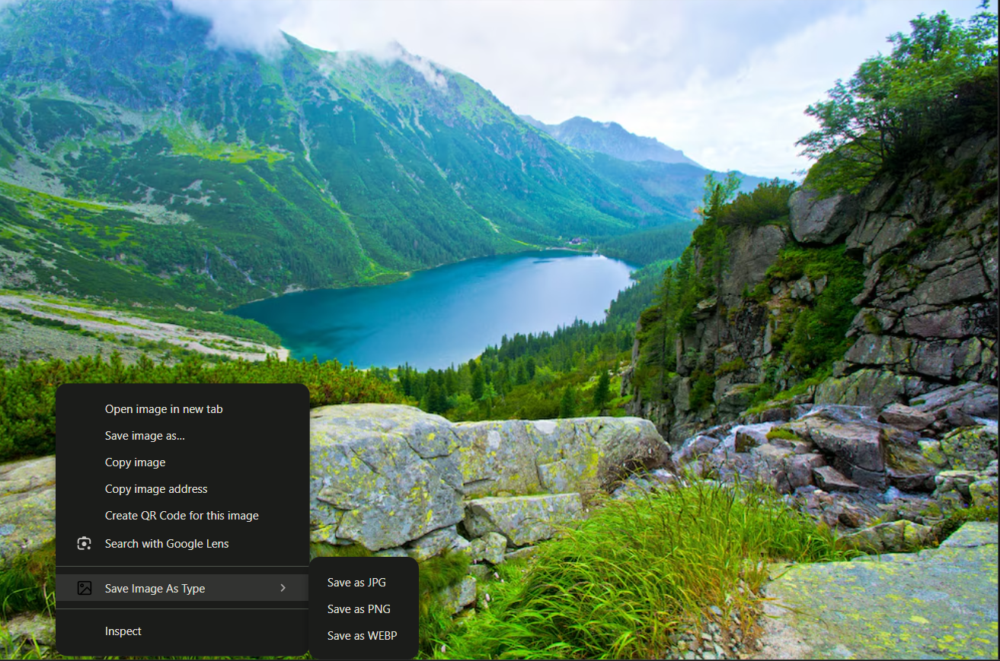

# 🖼️ Save Image As Type

> A powerful Chrome extension that revolutionizes how you save and convert images on the web

<div align="center">
  
</div>

<div align="center">

[](https://opensource.org/licenses/MIT)
[](https://chrome.google.com/webstore/detail/your-extension-id)
[](https://chrome.google.com/webstore/detail/your-extension-id)

</div>

## 📖 Table of Contents

- [Features](#-features)
- [Installation](#-installation)
- [Usage Guide](#-usage-guide)
- [Advanced Settings](#%EF%B8%8F-advanced-settings)
- [Development](#-development)
- [Contributing](#-contributing)
- [Technical Details](#%EF%B8%8F-technical-details)
- [FAQ](#-frequently-asked-questions)
- [Privacy Policy](#-privacy-policy)
- [License](#-license)

## ✨ Features

### 🎯 Core Functionality

- **Instant Format Conversion**
  - Convert to JPG/JPEG with adjustable quality
  - Save as PNG with lossless compression
  - Transform to WebP for optimal web performance

### 🛠️ Advanced Options

- **Quality Control**
  - Adjustable compression (1-100%)
  - Smart quality presets for different image types
  - Preview quality changes in real-time

- **Image Optimization**
  - Intelligent compression algorithms
  - Metadata stripping capability
  - Color palette optimization for PNGs
  - Smart transparency handling

- **Dimension Control**
  - Custom resize options
  - Maintain aspect ratio toggle
  - Preset common dimensions
  - Batch processing capabilities

### 💫 User Experience

- **Intuitive Interface**
  - Clean, modern popup design
  - Easy-to-use context menu
  - Keyboard shortcuts support
  - Progress indicators for large files

- **Smart Defaults**
  - Remember last used settings
  - Format-specific preferences
  - Custom naming patterns
  - Quick reset options

## 🚀 Installation

### From Source

1. Clone this repository
2. Open Chrome and navigate to `chrome://extensions`
3. Enable "Developer mode"
4. Click "Load unpacked"
5. Select the extension directory

## 🎯 Usage Guide

### Basic Usage

1. **Right-click** any image on the web
2. Hover over "Save Image As Type"
3. Select your desired format:
   - **JPG**: Best for photographs and complex images
   - **PNG**: Ideal for screenshots and images with transparency
   - **WebP**: Perfect for web optimization

### Format Selection Guide

| Format | Best For | Quality Range | File Size |
|--------|----------|---------------|-----------|
| JPG | Photos, Complex Images | 60-90% | Smaller |
| PNG | Screenshots, Graphics | Lossless | Larger |
| WebP | Web Images | 75-90% | Smallest |

### Keyboard Shortcuts

- `Alt + S`: Open settings popup
- `Alt + J`: Quick save as JPG
- `Alt + P`: Quick save as PNG
- `Alt + W`: Quick save as WebP

## ⚙️ Advanced Settings

### Quality Settings

- **JPG/WebP Quality**: Adjust compression level (1-100%)
- **PNG Optimization**: Color palette optimization
- **Metadata Options**: Strip or preserve image metadata

### Dimension Control

- **Custom Width/Height**: Set specific dimensions
- **Aspect Ratio Lock**: Maintain proportions
- **Preset Sizes**: Common dimensions for social media

### File Management

- **Naming Pattern**: Customize output filenames
- **Save Location**: Choose default download directory
- **Conflict Resolution**: Auto-rename or replace

## 💻 Development

### Prerequisites

```bash
- Node.js (v14 or higher)
- Chrome Browser
- Git
```

### Setup Development Environment

1. Clone the repository:
```bash
git clone https://github.com/Saoud30/save-image-as-type.git
cd save-image-as-type
```

2. Install dependencies:
```bash
npm install
```

3. Build the extension:
```bash
npm run build
```

4. Load in Chrome:
- Open `chrome://extensions`
- Enable "Developer mode"
- Click "Load unpacked"
- Select the `dist` folder

### Project Structure

```
save-image-as-type/
├── src/
│   ├── background/
│   ├── popup/
│   └── utils/
├── public/
│   └── icons/
├── dist/
└── tests/
```

## 🤝 Contributing

We welcome contributions! Here's how you can help:

1. Fork the repository
2. Create your feature branch:
```bash
git checkout -b feature/AmazingFeature
```

3. Commit your changes:
```bash
git commit -m 'Add some AmazingFeature'
```

4. Push to the branch:
```bash
git push origin feature/AmazingFeature
```

5. Open a Pull Request

## 🛠️ Technical Details

### Architecture

- Built with modern Chrome Extension Manifest V3
- Uses Canvas API for image processing
- Implements Web Workers for performance
- Leverages Chrome Storage API for settings

### Performance Optimizations

- Lazy loading of conversion modules
- Efficient memory management
- Background processing for large files
- Caching of frequently used settings

## ❓ Frequently Asked Questions

### General Questions

**Q: Why choose this over browser's default save?**
A: Our extension offers format conversion, optimization, and quality control in one click.

**Q: Does it work offline?**
A: Yes, all processing is done locally in your browser.

### Technical Questions

**Q: What's the maximum file size?**
A: Chrome's limitations apply (typically around 500MB).

**Q: Does it preserve EXIF data?**
A: Optional - you can choose to strip or preserve metadata.

## 🔒 Privacy Policy

- No data collection
- All processing done locally
- No external server communication
- No analytics or tracking

## 📝 License

MIT © [Shazy]

---

<div align="center">

Made with ❤️ for the web

[Report Bug](https://github.com/Saoud30/save-image-as-type/issues) · [Request Feature](https://github.com/Saoud30/save-image-as-type/issues)

</div>